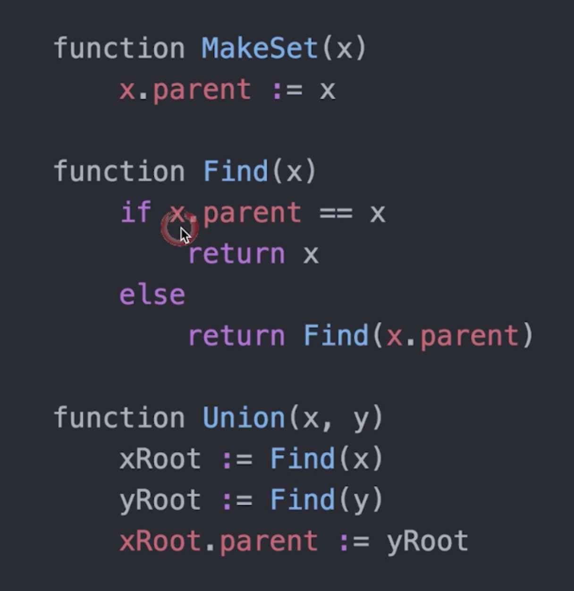

# 并查集

**Union & Find**是一种树形结构，用于处理一些不交集的合并和查询问题

**Find**确定元素属于哪个子集，它可以用来确定两个元素是否属于同一个子集。

**Union**将两个元素合并成一个子集。

**根本**：无归属，roots指向自己，有归属指向归属。

*涉及到并查集的例子*

- 老大-小弟
- 帮派识别
- 两种优化方式

*并查集伪代码*



**合并规则-1，即优化1**：把rank(深度)较低的合并到rank较高的集合中。

*union后半部替换如下*


**合并规则-2，即优化2**：把rank(深度)较低的合并到rank较高的集合中。


*优化2，findRoot实现路径压缩*


## Leetcode真题


**200-岛屿的个数-Medium**

> 明确题目

给定一个由 '1'（陆地）和 '0'（水）组成的的二维网格，计算岛屿的数量。一个岛被水包围，并且它是通过水平方向或垂直方向上相邻的陆地连接而成的。你可以假设网格的四个边均被水包围。

> 所有可能解法

- 遍历节点，如果为1则把相邻节点边置为0，周围节点为1，把该节点周围节点置为0，计数count，遍历周围节点可用DFS,BFS。

- 并查集， a:为1的节点，parent初始位为自己，b:遍历节点，进行合并，1合并，0不管。c:最后遍历，有多少个parent。

> CODINNG

```

```
> TESTING：leetcode

**547-朋友圈-Medium**

> 明确题目

班上有 N 名学生。其中有些人是朋友，有些则不是。他们的友谊具有是传递性。如果已知 A 是 B 的朋友，B 是 C 的朋友，那么我们可以认为 A 也是 C 的朋友。所谓的朋友圈，是指所有朋友的集合。

给定一个 N * N 的矩阵 M，表示班级中学生之间的朋友关系。如果M[i][j] = 1，表示已知第 i 个和 j 个学生互为朋友关系，否则为不知道。你必须输出所有学生中的已知的朋友圈总数。

示例 1:
```输入:
[[1,1,0],
 [1,1,0],
 [0,0,1]]
输出: 2
```
说明：已知学生0和学生1互为朋友，他们在一个朋友圈。
第2个学生自己在一个朋友圈。所以返回2。

> 所有可能解法

- 并查集

> CODINNG

```

```
> TESTING：leetcode
